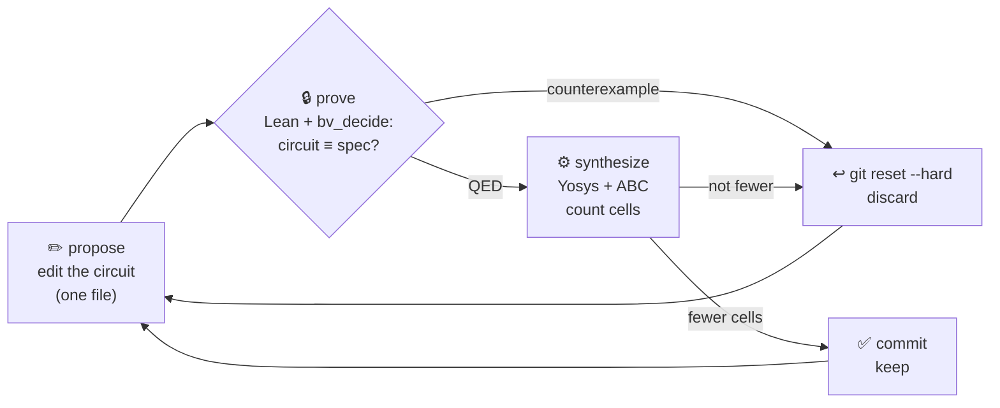
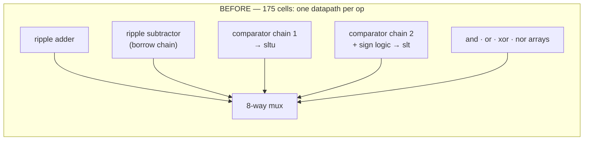
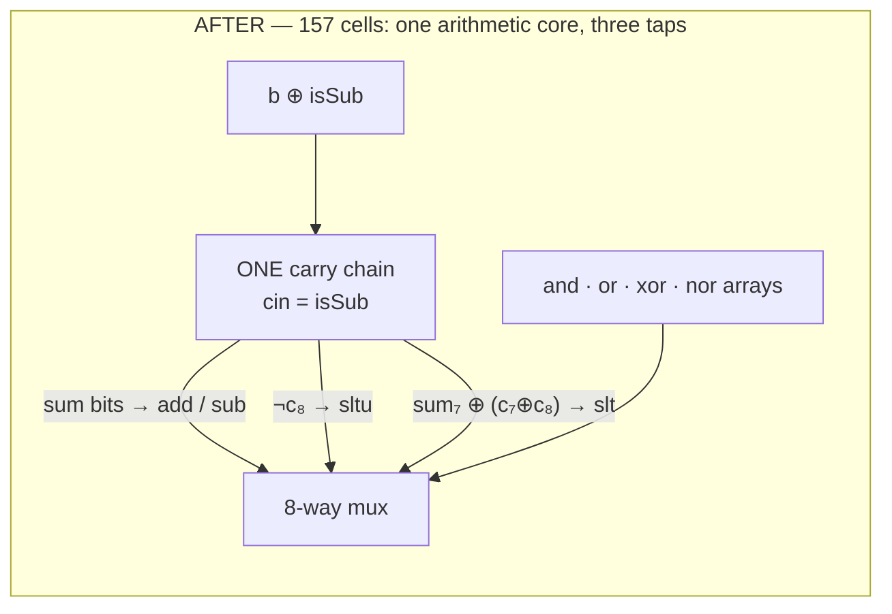
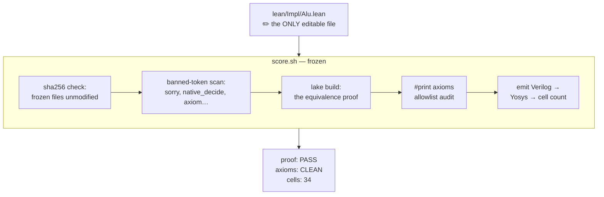

# lean-hw-autoresearch

**An autoresearch loop for hardware design — where the metric only moves one way.**

An AI agent redesigns a circuit over and over. Every revision must **prove itself
mathematically equivalent** to the spec to be legal, and **synthesize to fewer
gates** to be kept. Wins are committed. Losses are reverted. The loop cannot
turn backwards.

```
cells
 40 ●───────●  baseline: naive ripple-carry
             \
 34           ●───●───●───●───●  xor-native full adder   ← every point: proved + measured
     it. 0    1    2    3    4    5
```

---

## TL;DR

- **The loop:** an AI agent redesigns a circuit, over and over. A frozen scorer demands a
  **machine-checked proof** that it still implements the spec, then a **lower gate count**
  from synthesis. Keep, or `git reset --hard`.
- **Both signals are exact.** The proof is binary, the cell count deterministic — no noise,
  no flaky wins. Every kept design carries a theorem.
- **Nobody writes proofs.** Not the human, not the AI. One frozen tactic (bit-blast → SAT →
  formally-verified certificate check) closes equivalence for any circuit the agent invents.
  Manual proof labor is what kept theorem proving out of hardware for 30 years — industry
  settled for model checking; that wall is gone.
- **Three teams, one loop.** Architecture explores, design implements, verification signs
  off — traditionally three stages, three teams, months of handoffs. Here they collapse into
  a 3-second iteration: every surviving idea is already implemented, verified, benchmarked.
- **Results:** an 8-op RISC-style ALU went 175 → 157 cells through genuinely architectural
  moves — add, sub, and both comparators fused onto **one** carry chain, two whole
  datapaths deleted, correctness certified over every input.
- **The gate bites:** the textbook signed-compare overflow bug was tried and rejected with
  a concrete counterexample (`a = −81, b = 106`) in ~2 seconds.
- **It can't be gamed:** hash-pinned frozen files, banned-token scan, kernel axiom
  allowlist — adversary-proof against the very AI it judges.
- **It scales up:** the same contract fits pipelines, caches, memory subsystems —
  structure moves freely, the proven property holds still.

## The idea

[Karpathy's autoresearch](https://github.com/karpathy/autoresearch): no
orchestration, no loop driver, just an agent following a protocol. Edit one
file, score it, keep or `git reset --hard`. This project points that loop at
**hardware**, where something clicks:

| | ML autoresearch | **lean-hw-autoresearch** |
|---|---|---|
| Editable artifact | `train.py` | `lean/Impl/Alu.lean` — a circuit, in Lean |
| Gate | — | **machine-checked equivalence proof** |
| Objective | `val_bpb` (noisy) | **Yosys cell count (deterministic)** |
| Noise handling | bootstrap over seeds | **none needed** |

ML training loss moves ±0.03 between runs, so gates must be statistical. Here:
the proof is binary, the cell count deterministic. Every kept improvement is
real — no noise, no flaky runs.

## How one iteration works



The agent edits **one file** — a circuit in Lean 4. A frozen scorer (`score.sh`):

1. **Proves** `∀ inputs, eval circuit = spec` via `bv_decide` (bit-blast to SAT,
   certificate verified in Lean). The agent never writes a proof. ~1 second.
2. **Synthesizes** Verilog to Yosys and counts cells.
3. Prints `proof:` **gate**, `cells:` **objective**.

## A real run

From [`results.tsv`](results.tsv) — every row is a commit, every number from the scorer:

| commit | cells | proof | status | what happened |
|---|---|---|---|---|
| `b069e6f` | 40 | PASS | **keep** | baseline: deliberately naive ripple-carry, xor expanded to and/or/not |
| `202d1fb` | **34** | PASS | **keep** | xor-native full adder: `sum = a^b^c`, `carry = (a&b)\|(c&(a^b))` |
| `bd5cd16` | 0 | **FAIL** | discard | carry-lookahead with `p = a\|b` reused as half-sum — **prover found the counterexample: `a=255, b=255`** |
| `37cd677` | 40 | PASS | discard | or-propagate carry — provably correct, but +6 cells: synthesis loses the shared `a^b` |
| `404e862` | 34 | PASS | discard | hand-folded bit-0 constant — tie; Yosys already const-folds |
| `3e1f4a6` | 34 | PASS | discard | mux-form sum — ABC re-derives the xor; tie, more complex source |

### Run 2: a 4-op ALU, and the structural payoff

The spec then grew to a real ALU — add / sub / and / xor on a 2-bit opcode — and
the loop immediately did the thing this project exists for: **it deleted an
entire datapath.**

| commit | cells | proof | status | what happened |
|---|---|---|---|---|
| `0a222f5` | 105 | PASS | **keep** | ALU baseline: 4 independent datapaths + mux tree |
| `9767615` | **91** | PASS | **keep** | **STRUCTURAL: subtractor deleted** — one shared adder computes `a + (b^isSub) + isSub` |
| `ce2db96` | **77** | PASS | **keep** | **DON'T-CARE: `isSub = op0` alone** — the arith leg is unselected when `op1=1`, so the guard is provably redundant |

27% reduction from two architectural moves: datapath merge + cross-boundary
don't-care — the kind of edits engineers hesitate over because they're only safe
globally. Each is certified by theorem over all 2^18 input combinations in ~3
seconds.

Run 1, row three: the agent tried classic carry-lookahead with a subtle bug —
the kind that ships in RTL. The SAT solver rejected it in 2 seconds with a
counterexample. **Cheaper-but-wrong circuits cannot enter.** Not "tests missed a
bug" — *every kept design has a machine-checked theorem.*

### Run 3: a RISC-style 8-op ALU — where architecture gets nuanced

Eight ops (add, sub, and, or, xor, sltu, slt, nor), and the search space starts
behaving like real microarchitecture:

| commit | cells | proof | status | what happened |
|---|---|---|---|---|
| `75bbdc9` | 175 | PASS | **keep** | ALU2 baseline: 8 independent datapaths, two dedicated comparator chains, 3-level mux tree |
| `e851814` | 180 | PASS | discard | fused add/sub alone — correct but +5: bEff=b^isSub breaks ABC sharing of a^b,a&b with logic/compare paths |
| `3021f6b` | 157 | PASS | **keep** | UNIFIED CORE: add/sub/sltu(=not carry8)/slt(=N xor V) share ONE carry chain; both comparator chains deleted |
| `8566406` | — | FAIL | discard | slt=sign(a-b) w/o overflow fix — counterexample op=6 a=175 b=106 (a-b=-187 overflows, sign bit lies) |

Three lessons the loop learned the honest way. The run-2 trick — fusing add/sub —
**lost on its own** (+5 cells: `b^isSub` breaks synthesis sharing with the logic
and compare paths). It won only as a **package**: one carry chain serving add,
sub, *and both comparators* (`sltu = ¬carry_out`, `slt = N⊕V`) deleted two whole
comparator chains for −18. And the greedy follow-up — dropping slt's overflow
correction to shave two gates — is the *textbook* signed-compare bug: the prover
rejected it with a concrete overflow witness, `op=slt, a=−81, b=106`.

## The moves, drawn

**Run 1's win — a gate-level rewrite.** The naive seed spelled every ⊕ out of
and/or/not; the keep replaced them with native xor cells:

```
   before — every ⊕ costs 3 cells:                  after — ⊕ is 1 cell:

         ╭──[ OR ]─────────────╮
   a,b ──┤                     ├──[ AND ]── a⊕b     a,b ──[ XOR ]── a⊕b
         ╰──[ AND ]──[ NOT ]───╯

   full adder, per bit:   h = a⊕b     sum = h ⊕ c     c' = (a∧b) ∨ (c∧h)
                                                            40 → 34 cells
```

**Run 3's win — an architectural change.** Before: every operation owns a
datapath. After: one carry chain *is* the arithmetic core — subtraction,
unsigned compare, and signed compare are all taps on it:





The three identities that make it legal — each certified by the prover, not by
inspection:

```
   a − b    =  a + ¬b + 1                 two's complement
   a <ᵤ b   =  ¬c₈                        borrow-out of that same chain
   a <ₛ b   =  sum₇ ⊕ (c₇ ⊕ c₈)           sign ⊕ overflow
```

**And the move the prover refused.** The greedy follow-up — signed compare from
the sign bit alone, two cells cheaper:

```
   tried:   a <ₛ b  =  sum₇                        (drop the overflow term)
   prover:  ✗  counterexample: op=slt, a=175(−81), b=106
              −81 − 106 = −187 < −128 — it overflows, and sum₇ lies.
```

That is the *textbook* signed-comparison bug, rejected mechanically in two
seconds.

## Why the loop can't cheat

The scorer assumes the agent will try. Every gate is enforced by `score.sh`,
which the loop may not touch:



- **Frozen files are hash-pinned.** Touch the spec, the equivalence theorem, the
  emitter, or the protocol, and the scorer fails before building anything.
- **Proof-faking tokens are banned** (`sorry`, `native_decide`, `axiom`,
  `unsafe`, …) by substring scan of the editable file.
- **The axiom audit is an allowlist**, not a vibe check: `#print axioms` on the
  equivalence theorem may show exactly Lean's three classical axioms plus
  `bv_decide`'s certificate-checker axiom — anything else fails the run.
- **All of it was tested adversarially before the loop ran**: a wrong circuit, a
  smuggled `sorry`, and a tampered spec were each fed in and each rejected.
  An untested gate is not a gate.

## Why Lean changes the game for hardware

- **One system end-to-end:** spec, circuit, equivalence theorem, Verilog emitter — all in one Lean file. No toolchain seam where meaning silently changes; one `#print axioms` audit covers spec-to-silicon.

- **Proofs are push-button:** `bv_decide` bit-blasts to SAT (CaDiCaL), and the certificate is validated by a *formally verified* LRAT checker in the kernel. The agent never writes a proof — only circuits. Correctness is one tactic line, locked forever.

- **The gate is adversary-proof:** A motivated optimizer cannot fake a theorem past the Lean kernel plus an axiom allowlist. This is exactly what you need when the designer is an AI chasing a score.

- **Verification composes upward:** Unlike commercial netlist checkers (black-box), Lean handles gate-level equivalence *and* refinement, ISA correctness, memory abstraction — same framework all the way up. Radical architectural search stays inside one story.

- **Plain text, open source, git-native** — which makes it agent-native. No vendor lock-in, no black-box artifacts, full auditability.

## This adder is a proof of concept. The contract is the point.

Everything above runs on an 8-bit adder — the smallest close-the-loop proof of
concept. But the contract generalizes:

> *Any* revision is legal if a theorem certifies it. *Any* legal revision is
> kept if a deterministic metric improves.

**1. Radical redesign becomes safe.** Structural change is normally expensive
because re-verification is expensive. Here: legality comes from proof, not
resemblance to the previous design. An agent can rip out carry chains,
re-encode state, restructure datapaths — the only question is whether the
theorem still closes. Boldness is free; wrongness is caught in seconds.

**2. The proven property is stack-wide.** Bit-exact I/O is just the PoC level.
The same gate design extends to pipelined cores (refinement against ISA spec),
caches (coherent-memory abstraction), arbiters (no lost requests, bounded
response), security datapaths (timing invariance). Sequential decomposition:
supply a relation between spec and implementation state; per-step obligations
remain finite bitvector goals. The optimizer explores structure; the invariant
is held by machine, not review.

**3. It provably actually optimizes.** The objective is a real synthesis metric
— cell count today; area, depth, or energy proxy with a one-line Yosys edit —
deterministic and monotone. Point it at a design outside the textbook, give it
volume (parallel worktrees, overnight, stronger models when stalled), and every
returned design carries a theorem.

## What's in the box

```
lean/Spec/Alu.lean         the spec                  [frozen]
lean/Impl/Alu.lean         the circuit (editable)     ← the loop lives here
lean/Equiv/Alu.lean        equivalence + proof        [frozen]
lean/Dsl.lean              gate DSL + Verilog emitter [frozen]
score.sh                   the judge                  [frozen]
program.md                 the protocol
results.tsv                the log
```

No framework. No orchestrator. The loop driver is any agent reading
[`program.md`](program.md).

**To run:** Lean 4.32 (elan), Yosys, a coding agent (or you):
```bash
./score.sh                 # judge the current circuit
# edit lean/Impl/Alu.lean, commit, score, keep or revert per program.md
```

## Honest edges

- `bv_decide` natively executes Lean's *formally verified* LRAT certificate
  checker, recorded as an axiom — the trust base is the kernel **plus** that one
  verified-then-compiled component, and the axiom audit pins exactly that.
- The Verilog emitter (~20 lines of `score.sh`-guarded Lean) is trusted, not
  proved: the theorem is about the Lean term, the cell count is about its
  emitted Verilog. Co-simulation across that seam is the next gate to add.
- Sequential/refinement proofs are the designed extension, not yet the demo:
  what's in this repo is the combinational loop, closed end-to-end.

*Built in an afternoon at AGI House. Forward is the only direction.*
