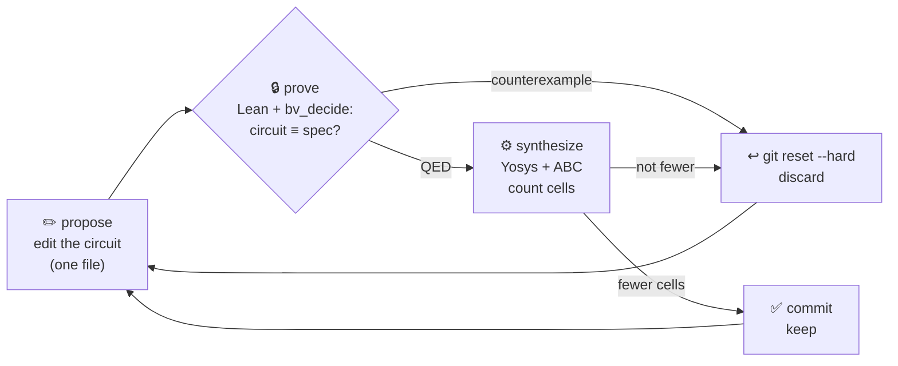
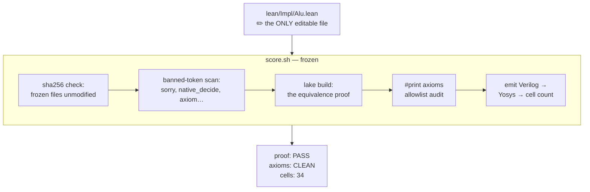

# Ratchet

**An autoresearch loop for hardware design — where the metric only moves one way.**

An AI agent redesigns a circuit over and over. Every revision must **prove itself
mathematically equivalent** to the spec to be legal, and **synthesize to fewer
gates** to be kept. Wins are committed. Losses are reverted. Like the tool it's
named after, the loop physically cannot turn backwards.

```
cells
 40 ●───────●  baseline: naive ripple-carry
             \
 34           ●───●───●───●───●  xor-native full adder   ← every point: proved + measured
     it. 0    1    2    3    4    5
```

---

## The idea

[Karpathy's autoresearch](https://github.com/karpathy/autoresearch) showed the
shape: no orchestration framework, no Python loop driver. The loop is just a
coding agent following a protocol file — edit one file, run a frozen scorer,
keep or `git reset --hard`. Applied to ML training, it hill-climbs validation
loss.

Ratchet points that loop at **hardware**, and something clicks into place that
ML can't offer:

| | ML autoresearch | **Ratchet** |
|---|---|---|
| Editable artifact | `train.py` | `lean/Impl/Alu.lean` — a circuit, in Lean |
| Gate | — | **machine-checked equivalence proof** |
| Objective | `val_bpb` (noisy) | **Yosys cell count (deterministic)** |
| Noise handling | bootstrap over seeds | **none needed** |

A training loss moves ~±0.03 between identical runs, so ML loops need
statistical gating to avoid chasing noise. Here the verifier is **exact**: the
proof is binary and the cell count is deterministic. *Every accepted improvement
is real.* No flaky wins, no optimistic running minimum — a ratchet, not a
random walk.

## How one iteration works



The agent edits **one file** — the circuit, written in a tiny deep-embedded HDL
in Lean 4. A frozen scorer (`score.sh`) then:

1. **Proves** the circuit still implements the spec — `∀ inputs, eval circuit = spec` —
   discharged push-button by `bv_decide` (bit-blasting to SAT, certificate
   checked back in Lean). The agent never writes a proof; it only supplies
   circuits. ~1 second per iteration.
2. **Synthesizes** the emitted Verilog with Yosys/ABC and counts cells.
3. Prints two signals: `proof:` **gates**, `cells:` **ranks**.

## A real run

From [`results.tsv`](results.tsv) — every row is a git commit in this repo, every
number came out of the scorer:

| commit | cells | proof | status | what happened |
|---|---|---|---|---|
| `b069e6f` | 40 | PASS | **keep** | baseline: deliberately naive ripple-carry, xor expanded to and/or/not |
| `202d1fb` | **34** | PASS | **keep** | xor-native full adder: `sum = a^b^c`, `carry = (a&b)\|(c&(a^b))` |
| `bd5cd16` | 0 | **FAIL** | discard | carry-lookahead with `p = a\|b` reused as half-sum — **prover found the counterexample: `a=255, b=255`** |
| `37cd677` | 40 | PASS | discard | or-propagate carry — provably correct, but +6 cells: synthesis loses the shared `a^b` |
| `404e862` | 34 | PASS | discard | hand-folded bit-0 constant — tie; Yosys already const-folds |
| `3e1f4a6` | 34 | PASS | discard | mux-form sum — ABC re-derives the xor; tie, more complex source |

Row three is the one to stare at: the agent tried a classic carry-lookahead
optimization with a subtle bug — the kind that ships in real RTL and gets
caught in silicon. The SAT solver rejected it in ~2 seconds with a concrete
counterexample. **A cheaper-but-wrong circuit cannot enter this loop.** Not
"our tests didn't catch a bug" — *there is a machine-checked theorem for every
kept design.*

## Why the loop can't cheat

The scorer assumes the agent will try. Every gate is enforced by `score.sh`,
which the loop may not touch:



- **Frozen files are hash-pinned.** Touch the spec, the equivalence theorem, the
  emitter, or the protocol, and the scorer fails before building anything.
- **Proof-faking tokens are banned** (`sorry`, `native_decide`, `axiom`,
  `unsafe`, …) by substring scan of the editable file.
- **The axiom audit is an allowlist**, not a vibe check: `#print axioms` on the
  equivalence theorem may show exactly Lean's three classical axioms plus
  `bv_decide`'s certificate-checker axiom — anything else fails the run.
- **All of it was tested adversarially before the loop ran**: a wrong circuit, a
  smuggled `sorry`, and a tampered spec were each fed in and each rejected.
  An untested gate is not a gate.

## What's in the box

```
lean/Spec/Alu.lean    the mathematical spec            [frozen]
lean/Impl/Alu.lean    the circuit — agent-editable     ← the loop lives here
lean/Equiv/Alu.lean   equivalence theorem, generic
                      proof: simp + bv_decide          [frozen]
lean/Dsl.lean         ~60-line gate DSL + Verilog
                      emitter                          [frozen]
score.sh              the judge                        [frozen]
program.md            the protocol the agent follows
results.tsv           the log — one row per iteration
```

No framework. No orchestrator. The "loop driver" is any coding agent reading
[`program.md`](program.md), which fits on two pages.

### Run it

Needs Lean 4.32 (via elan), Yosys, and a coding agent — or you, playing one:

```bash
./score.sh                 # judge the current circuit
# then follow program.md: edit lean/Impl/Alu.lean, commit, score, keep or revert
```

## Honest edges

- `bv_decide` natively executes Lean's *formally verified* LRAT certificate
  checker, recorded as an axiom — the trust base is the kernel **plus** that one
  verified-then-compiled component, and the axiom audit pins exactly that.
- The Verilog emitter (~20 lines of `score.sh`-guarded Lean) is trusted, not
  proved: the theorem is about the Lean term, the cell count is about its
  emitted Verilog. Co-simulation across that seam is the next gate to add.
- Current spec is an 8-bit adder — deliberately small, chosen so the whole loop
  closed in an afternoon. The shape generalizes: wider ALUs, then sequential
  circuits via refinement proofs, with SAT staying push-button per step.

## Where this goes

An 8-bit adder is the *hello world*, not the point. The point is the shape:
**an exact, adversary-proof fitness function for hardware**, cheap enough to run
every few seconds. Put a stronger agent in the loop, run parallel searches in
git worktrees overnight, point it at circuits where the optimal answer isn't in
a textbook — and every design it ever returns comes with a theorem attached.

*Built at AGI House. The name is the mechanism: forward is the only direction.*
